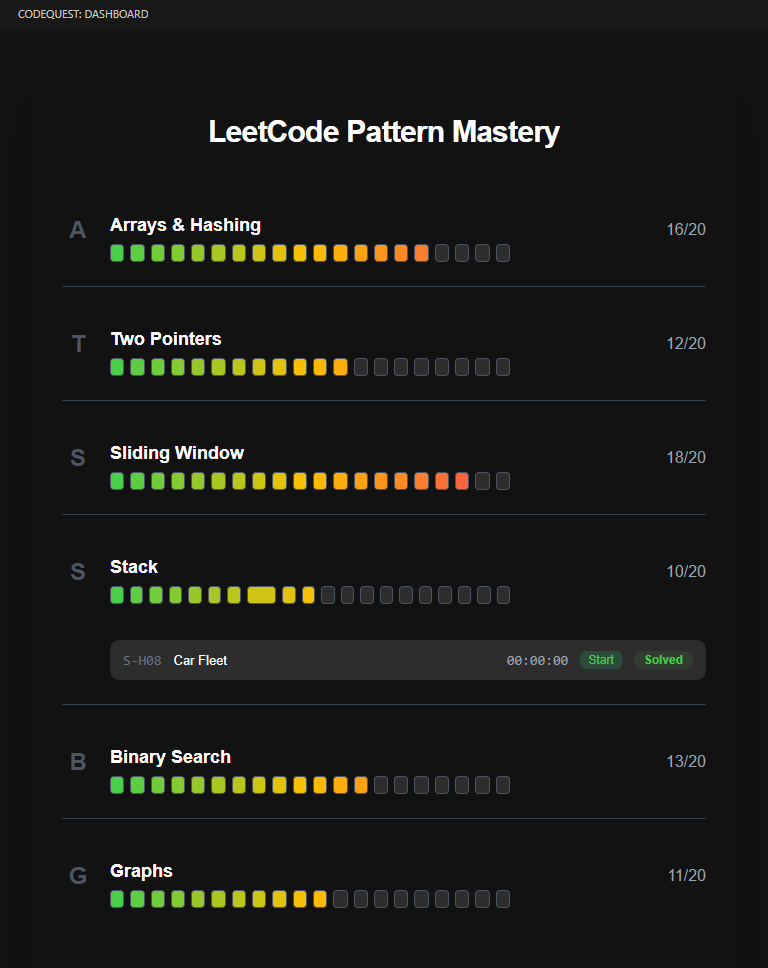
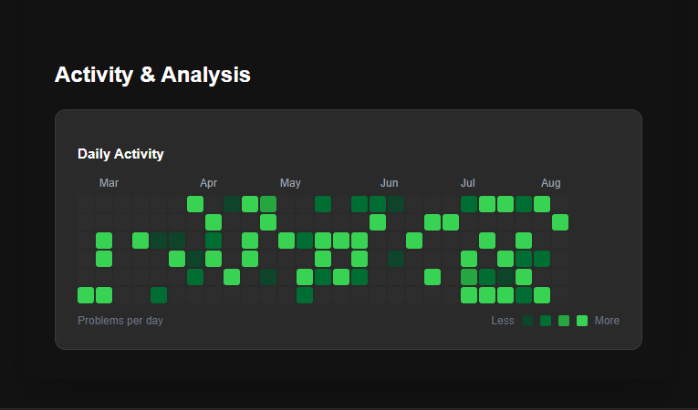
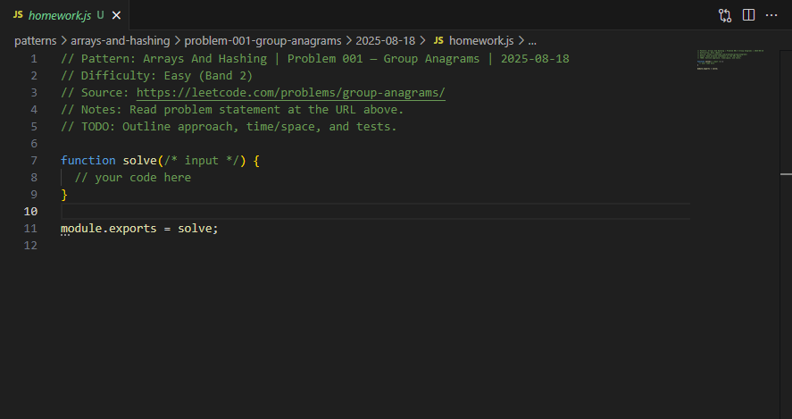

# CodeQuest

**Master LeetCode patterns directly in VS Code.** CodeQuest transforms your coding practice into a visual journey with progress tracking, pattern mastery, and intelligent insights.

## Features

- **Visual Progress Dashboard** - Track your LeetCode journey with GitHub-style contribution heatmaps
- **Pattern Mastery System** - Focus on the 6 essential coding patterns with structured learning paths  
- **Difficulty-Based Progress** - Easy/Medium/Hard tracking with visual indicators
- **Session Analytics** - Monitor your practice consistency and improvement over time
- **Real-time Sync** - Instantly updates as you solve problems in your workspace

## Quick Start

### Local Development Setup
1. **Clone Repository**: `git clone https://github.com/tayyab3245/codequest-vs-extension.git`
2. **Install Dependencies**: `cd CodeQuest-Coach && npm install`
3. **Open in VS Code**: Open the project folder in VS Code
4. **Run Extension**: Press `F5` to launch Extension Development Host
5. **Activate**: In the new VS Code window, click the CodeQuest icon in the Activity Bar
6. **Practice**: Organize your LeetCode solutions and watch your progress grow

## Pattern Categories

CodeQuest recognizes 6 essential coding patterns including:
- Arrays & Hashing
- Two Pointers  
- Sliding Window
- Stack & Queues
- Binary Search
- Trees & Graphs

## Progress Tracking

- **Daily Activity Heatmap** - Visualize your coding consistency
- **Session History** - Track your practice sessions over time

## Known Issues

- **File Generation**: Selecting a problem in the dashboard doesn't automatically generate the problem file sometimes.

## Future Enhancements

- **AI-Powered Insights** - Get personalized recommendations based on your progress patterns
- **Smart Problem Suggestions** - Intelligent next-problem recommendations  
- **Performance Analytics** - Advanced metrics and learning insights
- **Study Plan Generation** - Automated study schedules based on your goals
- **Pattern Completion Status** - See which areas need more practice  

## License

Copyright (c) 2025 tayyab3245. All rights reserved.

This software is proprietary and confidential. See [LICENSE](LICENSE) for full terms.

---

**Ready to master coding patterns?** Setup CodeQuest and transform your LeetCode practice into a visual, data-driven journey!
